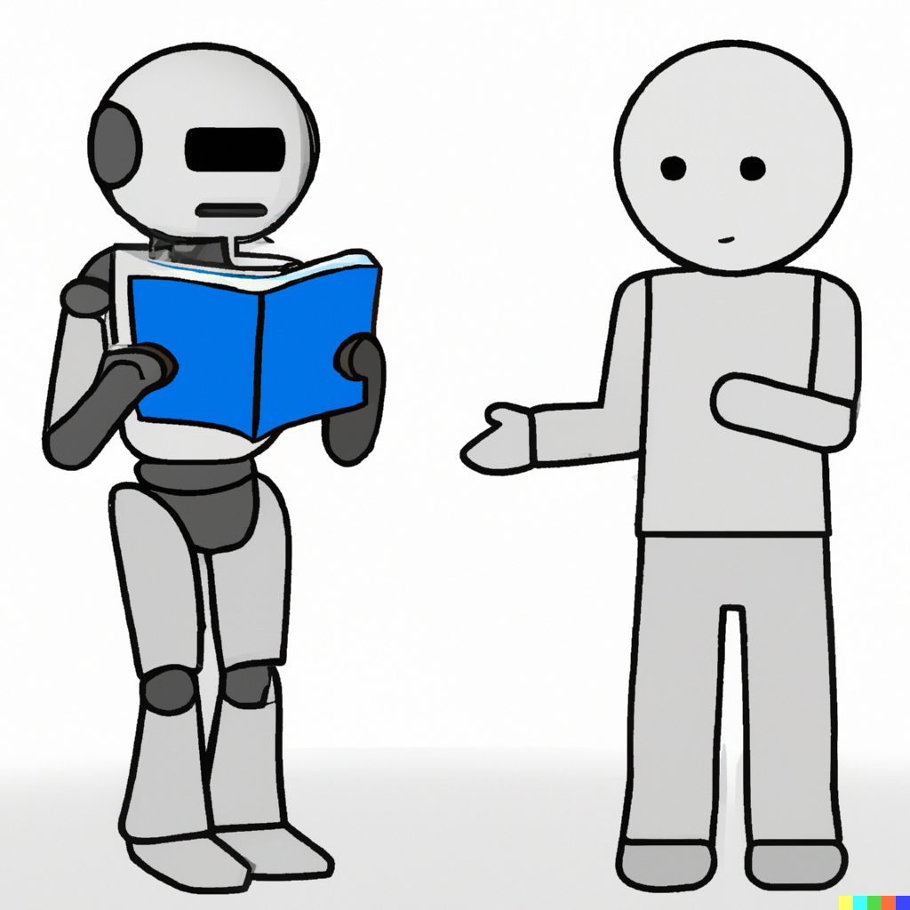

# Talk to Your PDFs




## Have a conversation with your PDFs. No reading required.

Tired of sifting through endless pages of text to find the information you need? Talk to PDF lets you query your PDFs directly, just as you would chat with a friend. It's like having your own personal assistant for all your PDF-related tasks.

## Key Features
- **Natural Language Search:** Ask questions in plain English, and get accurate answers back from your PDFs.
- **Streamlined Chatbot Interface:** Interact with your PDFs effortlessly through a user-friendly chatbot-style interface powered by a Streamlit app.
- **Powered by Cutting-Edge AI:** Leverages advanced language processing and semantic search technologies to understand the context of your questions and deliver relevant responses.
- **Handles Diverse PDF Types:** Works effectively with a wide range of PDF documents, including textbooks, research papers, business reports, contracts, and more.

<!-- 
- **Conversational Interface**: Engage in natural language conversations with your PDF documents through the provided chatbot interface.

- **Document Indexing**: Utilize LangChain to index your PDF documents, enabling efficient and fast querying.

- **AI-powered Responses**: Leverage OpenAI's GPT-3 model to obtain intelligent responses to your queries.

- **PDF Rendering**: Ensure successful PDF rendering by installing the necessary libraries, such as poppler-utils. -->

## Installation

```bash
pip install -r requirements.txt
```

## Dependencies
-   langchain
-   unstructured
-   openai
-   chromadb
-   tiktoken

## Usage

### Set OpenAI API Key
Set you openai api key in `main.py`.

### Document Directory
Place your pdfs in `docs` folder.

### Run the app
```bash
streamlit run app.py
```
Now You can ask questions about your pdf files from the bot.


## Demo
(https://youtu.be/pI8_JtokgVs)


# About me
I am Israr Ahmed, passionate about AI/DS/ML/DL. I work on tasks related to computer vision, nlp, gen ai, ml ops and also on resful apis like Flask or Fast Api.

* [LinkedIn](https://www.linkedin.com/in/ahmedisrar919/)
* [Medium](https://medium.com/@Ahmedisrar919)
